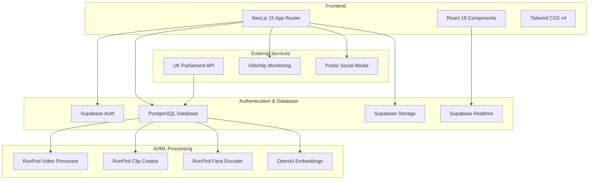
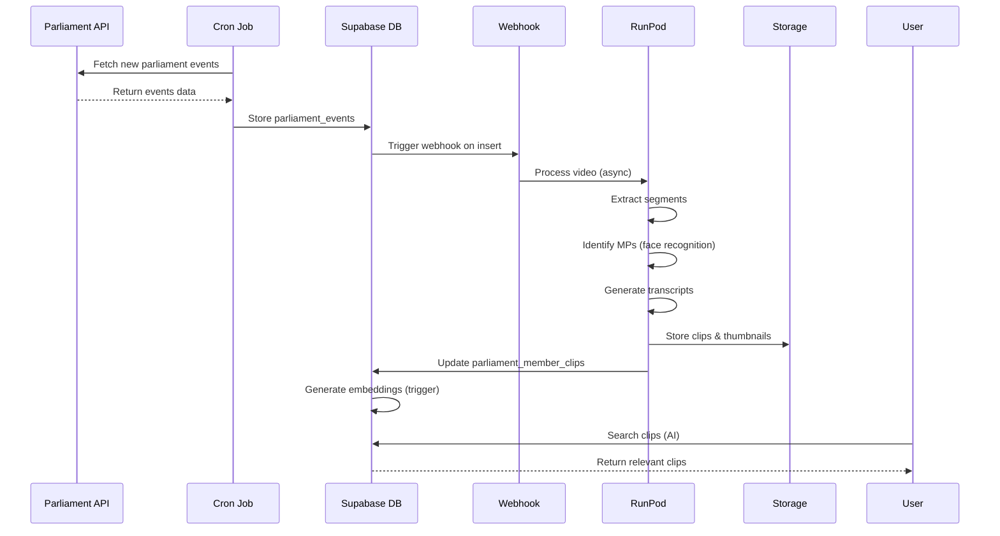
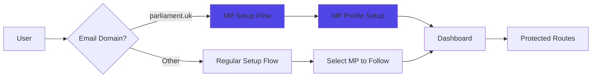
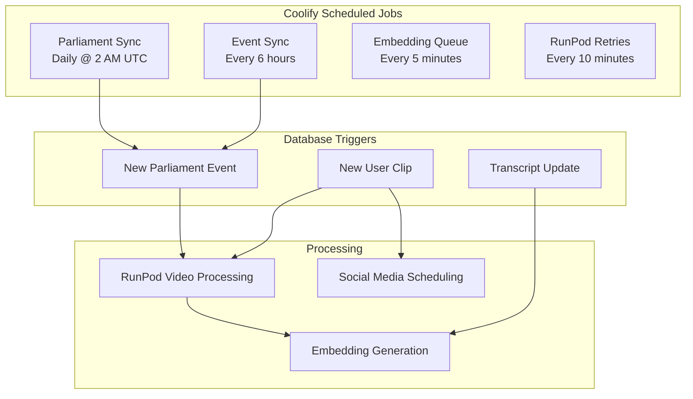

# The MP AI

> AI-powered platform for UK MPs and their staff to create, search, and share parliamentary video clips with advanced AI capabilities.


## Overview

The MP AI is a cutting-edge platform designed specifically for UK Members of Parliament and their staff to efficiently manage and share parliamentary content. The platform automatically processes parliament session videos, enables AI-powered search capabilities, and provides tools for creating and sharing clips across social media platforms.

### Key Features

- **Automated Video Processing** - Automatically processes UK Parliament session videos via RunPod GPU
- **AI-Powered Search** - Search clips by topic, context, or specific MP statements using vector embeddings
- **Clip Creation & Editing** - Create custom clips with segments and watermarks
- **Social Media Integration** - Schedule and share clips via Postiz (Facebook, Twitter/X, Instagram, TikTok, Bluesky)
- **Real-time Notifications** - Get notified when followed MPs speak in Parliament
- **Analytics Dashboard** - Track clip performance and engagement metrics
- **Watermark Support** - Add custom watermarks to clips for branding
- **Team Collaboration** - Create teams, invite members, and share clips within organizations
- **Face Recognition** - Automatic MP identification using face encoding technology

## Architecture

### System Architecture



### Data Flow - Video Processing Pipeline



### Authentication Flow



### Cron Jobs & Background Tasks



## Tech Stack

### Frontend

- **Framework**: Next.js 15 with App Router and Turbopack
- **UI Library**: React 19
- **Styling**: Tailwind CSS v4
- **UI Components**: Shadcn/ui with Radix UI primitives
- **State Management**: Legend State v3
- **Forms**: React Hook Form + Zod validation
- **Video Player**: Custom enhanced video player with segment support

### Backend & Infrastructure

- **Database**: PostgreSQL via Supabase
- **Authentication**: Supabase Auth with magic links & OTP
- **File Storage**: Supabase Storage for videos and images
- **Real-time**: Supabase Realtime subscriptions
- **API**: Next.js API routes with middleware authentication

### AI/ML Services

- **Video Processing**: RunPod serverless GPU functions
- **Face Recognition**: RunPod Face Encoder for MP identification
- **Embeddings**: OpenAI text-embedding-3-small (1536 dimensions)
- **Search**: pgvector with HNSW index for similarity search

### DevOps & Monitoring

- **Deployment**: Coolify (self-hosted)
- **Build**: Nixpacks configuration
- **Error Tracking**: Glitchtip (Sentry-compatible)
- **Testing**: Playwright for E2E tests
- **Email Testing**: Mailpit for local development

## Database Schema

The platform uses 10+ core tables in PostgreSQL:

| Table                         | Description                             |
| ----------------------------- | --------------------------------------- |
| `parliament_members`          | UK MPs and Lords data (500+ records)    |
| `parliament_member_clips`     | AI-detected video clips with embeddings |
| `parliament_member_portraits` | MP headshots and images                 |
| `parliament_member_contacts`  | Contact information and social media    |
| `parliament_events`           | Parliament Live TV events               |
| `user_clips`                  | User-created clips                      |
| `user_roles`                  | User authentication & settings          |
| `teams`                       | Team management                         |
| `team_members`                | Team membership with roles              |
| `team_invitations`            | Email invitations with tokens           |
| `runpod_processing_logs`      | RunPod job tracking and retries         |

## RunPod Integration

The platform uses three RunPod serverless GPU endpoints:

### 1. Video Processor

- **Purpose**: Process parliament session videos
- **Input**: `parliament_event_id`
- **Output**: Segments, speaker identification, transcripts, clip URLs

### 2. Clip Creator

- **Purpose**: Create user-generated clips
- **Input**: `user_clip_id`
- **Output**: Horizontal/vertical clips, thumbnails

### 3. Face Encoder

- **Purpose**: Generate face encodings for MP identification
- **Input**: `detection_threshold` (default 0.65)
- **Output**: Face encoding statistics

### Database Triggers

- `auto_trigger_parliament_video_processing` - Fires on new parliament events
- `auto_trigger_user_clip_processing` - Fires on new user clips

### Retry System

| Error Type          | Retryable | Max Attempts |
| ------------------- | --------- | ------------ |
| 5xx (Server errors) | Yes       | 3            |
| Timeout/Network     | Yes       | 3            |
| 4xx (Client errors) | No        | -            |
| Invalid data        | No        | -            |

## Team Collaboration

The platform supports team-based workflows for MP offices:

### Features

- **Team Creation** - MPs can create teams for their staff
- **Role-Based Access** - Owner, Administrator, User roles
- **Invitation System** - Email invitations with 7-day expiry tokens
- **Team MP Follows** - Teams can track specific MPs together
- **Shared Clip Library** - Team-owned clips accessible to all members
- **Notification Preferences** - Per-user notification settings within teams

### Workflow

1. MP creates a team from their dashboard
2. MP invites staff members via email
3. Staff members accept invitation and join team
4. Team members can create/view shared clips
5. Social media posting is coordinated across the team

## Social Media Integration

The platform integrates with Postiz for social media scheduling:

### Supported Platforms

- Facebook
- Twitter/X
- Instagram
- TikTok
- Bluesky (OAuth integration)

### Features

- Schedule clips for automatic posting
- Multi-platform publishing
- Analytics tracking for engagement
- Custom watermark support for branding

## Getting Started

### Prerequisites

- Node.js 18+
- pnpm package manager
- Docker (for local Supabase)
- Supabase CLI

### Installation

1. **Clone the repository**

```bash
git clone <repository-url>
cd new-mpai-frontend
```

2. **Install dependencies**

```bash
pnpm install
```

3. **Set up environment variables**

```bash
cp .env.example .env.local
```

Edit `.env.local` with your configuration:

```env
# Supabase Configuration
NEXT_PUBLIC_SUPABASE_URL=your_supabase_url
NEXT_PUBLIC_SUPABASE_ANON_KEY=your_anon_key
SUPABASE_SERVICE_KEY=your_service_role_key

# RunPod Configuration
RUNPOD_API_KEY=your_runpod_api_key
RUNPOD_VIDEO_PROCESSOR_ENDPOINT=your_endpoint
RUNPOD_CLIP_CREATOR_ENDPOINT=your_endpoint
RUNPOD_FACE_ENCODER_ENDPOINT=your_endpoint

# Parliament API
PARLIAMENT_API_BASE_URL=https://api.parliament.uk

# Social Media (Postiz)
POSTIZ_API_KEY=your_postiz_api_key

# Error Monitoring (Optional)
NEXT_PUBLIC_GLITCHTIP_DSN=your_glitchtip_dsn
```

4. **Start local Supabase**

```bash
supabase start
```

5. **Run database migrations**

```bash
supabase db push --local
```

6. **Generate TypeScript types**

```bash
pnpm genTypes
```

7. **Start development server**

```bash
pnpm dev
```

Visit `http://localhost:3000` to see the application.

### Email Testing

Access Mailpit at `http://localhost:55324` to view all authentication emails (magic links, OTPs) during local development.

## Project Structure

```
app/
├── (publicPages)/         # Public routes
│   ├── signin/           # Sign in page
│   ├── signup/           # Sign up page
│   └── (homePage)/       # Landing page
├── (privatePages)/       # Protected routes
│   ├── dashboard/        # Main dashboard
│   │   ├── my-clips/    # User's clips library
│   │   ├── create-clips/# Clip creation interface
│   │   ├── teams/       # Team management
│   │   └── settings/    # User preferences
│   ├── setup/           # User onboarding
│   └── mp-setup/        # MP-specific onboarding
└── api/                 # API routes
    ├── clips/          # Clip management
    ├── cron/           # Scheduled jobs
    ├── runpod/         # RunPod integrations
    ├── teams/          # Team operations
    └── settings/       # User settings
components/
├── ui/                  # Shadcn/ui components
services/
├── parliament/          # Parliament API integration
├── runpod/             # RunPod service layer
├── ai/                 # AI/ML services
├── postiz/             # Social media scheduling
└── bluesky/            # Bluesky integration
supabase/
├── migrations/         # Database migrations
└── config.toml        # Supabase configuration
```

## Development

### Available Scripts

```bash
pnpm dev              # Start development server
pnpm build            # Build for production
pnpm start            # Start production server
pnpm lint             # Run ESLint
pnpm test:e2e         # Run Playwright tests
pnpm genTypes         # Generate TypeScript types from Supabase
```

### Database Migrations

Create new migration:

```bash
supabase migration new migration_name
```

Apply migrations:

```bash
supabase db push --local
pnpm genTypes  # Update TypeScript types
```

### API Routes

| Endpoint                            | Method  | Description               |
| ----------------------------------- | ------- | ------------------------- |
| `/api/clips/create`                 | POST    | Create new clip           |
| `/api/clips/search`                 | GET     | AI-powered clip search    |
| `/api/cron/parliament-sync`         | POST    | Sync parliament data      |
| `/api/cron/parliament-event-sync`   | POST    | Sync parliament events    |
| `/api/cron/process-embedding-queue` | POST    | Process embedding queue   |
| `/api/cron/process-runpod-retries`  | POST    | Retry failed RunPod jobs  |
| `/api/runpod/process-video`         | POST    | Trigger video processing  |
| `/api/runpod/create-clip`           | POST    | Create clip from segments |
| `/api/runpod/encode-faces`          | POST    | Process face encodings    |
| `/api/teams/*`                      | Various | Team CRUD operations      |
| `/api/settings/profile`             | GET/PUT | User profile management   |

### Cron Jobs

The platform runs scheduled jobs via Coolify:

| Job                    | Schedule         | Description                           |
| ---------------------- | ---------------- | ------------------------------------- |
| Parliament Member Sync | Daily @ 2 AM UTC | Syncs MP data from UK Parliament API  |
| Parliament Event Sync  | Every 6 hours    | Fetches new parliament session videos |
| Embedding Queue        | Every 5 minutes  | Processes transcript embeddings       |
| RunPod Retries         | Every 10 minutes | Retries failed video processing jobs  |

## Testing

### E2E Testing with Playwright

```bash
# Run all tests
pnpm test:e2e

# Run in UI mode
pnpm test:e2e:ui

# Run specific test
pnpm test:e2e tests/auth.spec.ts

# Debug mode
pnpm test:e2e:debug
```

### Test Coverage Areas

- Authentication flows (magic link, OTP)
- Dashboard functionality
- Clip creation and editing
- Search capabilities
- Social media sharing
- MP setup process
- Team management

## Deployment

### Nixpacks Configuration

The project includes a `nixpacks.toml` for optimized containerized deployment:

```toml
[variables]
NODE_ENV = "production"

[phases.setup]
nixPkgs = ["nodejs_20", "pnpm", "fontconfig", "freetype"]

[phases.install]
cmds = ["pnpm install"]

[phases.build]
cmds = ["pnpm run build"]

[start]
cmd = "pnpm start"
```

### Production Deployment

1. **Database Setup**
   - Deploy Supabase instance
   - Run all migrations
   - Configure storage buckets

2. **Environment Variables**
   - Set all production environment variables
   - Configure RunPod endpoints
   - Set up Glitchtip monitoring
   - Configure Postiz API keys

3. **Deploy Application**
   - Deploy to Coolify or preferred platform
   - Configure domain and SSL
   - Set up cron job authentication

4. **Configure Scheduled Tasks**
   - Set up Coolify scheduled tasks for cron jobs
   - Configure CRON_SECRET for authentication

## Security

- **Authentication**: Secure magic link and OTP authentication via Supabase
- **Authorization**: Role-based access control for MPs vs regular users
- **API Security**: Protected API routes with middleware validation and CRON_SECRET
- **Data Protection**: Row Level Security (RLS) policies in PostgreSQL
- **Secret Management**: Environment variables for sensitive configuration

## Features in Detail

### Video Processing Pipeline

1. Parliament API provides session videos
2. Database trigger fires on new events
3. RunPod processes videos to extract segments
4. Face recognition identifies MPs in videos
5. Automatic transcript generation
6. Embeddings generated for AI search
7. Failed jobs automatically retried

### AI-Powered Search

- Natural language search queries
- Search by topic, context, or MP statements
- Vector similarity search using pgvector with HNSW index
- Full-text search with GIN index
- Real-time search suggestions

### Social Media Integration

- Schedule clips for automatic posting via Postiz
- Support for Facebook, Twitter/X, Instagram, TikTok, Bluesky
- Analytics tracking for engagement
- Custom watermark support

## Documentation

For comprehensive technical documentation, see [PROJECT_DOCUMENTATION.md](./PROJECT_DOCUMENTATION.md).

## Contributing

Contributions are welcome! Please follow these steps:

1. Fork the repository
2. Create a feature branch (`git checkout -b feature/amazing-feature`)
3. Commit your changes (`git commit -m 'Add amazing feature'`)
4. Push to the branch (`git push origin feature/amazing-feature`)
5. Open a Pull Request

## License

This project is proprietary software. All rights reserved.

## Acknowledgments

- UK Parliament API for providing session data
- RunPod for GPU-accelerated video processing
- Supabase for backend infrastructure
- Postiz for social media scheduling
- The open-source community for amazing tools and libraries

---

Built with care for UK Parliament transparency and democratic engagement.
